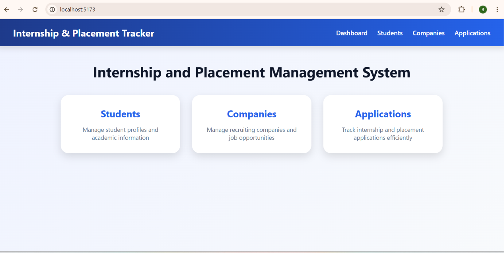
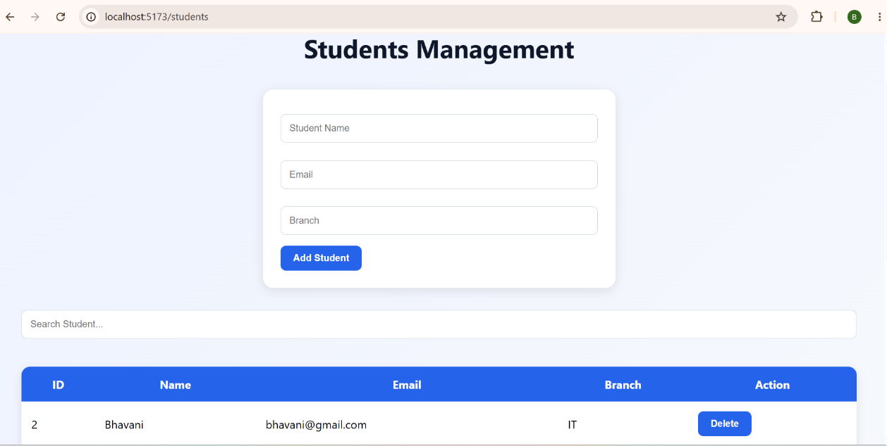
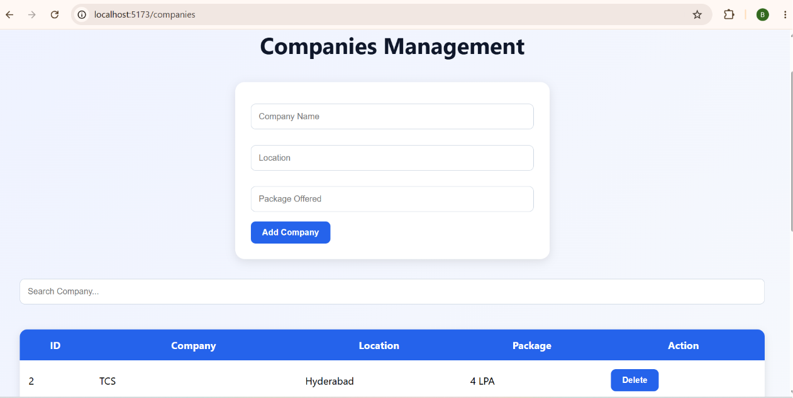
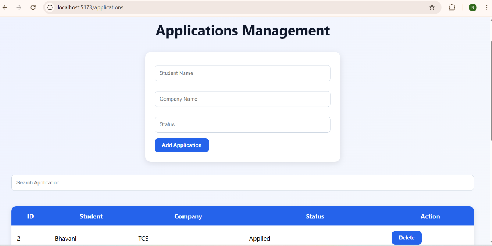

# Internship and Placement Management System

A full-stack web application developed using React.js, Spring Boot, and MySQL to manage students, companies, internships, and placement applications efficiently.

## Features

* Student Management
* Company Management
* Application Tracking
* Create, Read, and Delete Operations
* Search Functionality
* REST API Integration
* MySQL Database Connectivity
* Responsive Dashboard UI

## Technology Stack

### Frontend

* React.js
* Vite
* Axios
* CSS3

### Backend

* Spring Boot
* Spring Data JPA
* Maven

### Database

* MySQL

## Project Modules

### Students

* Add Student
* View Student Details
* Search Student Records
* Delete Student Records

### Companies

* Add Company
* View Company Details
* Search Company Records
* Delete Company Records

### Applications

* Add Application
* Track Placement Applications
* View Application Details
* Search Applications
* Delete Applications

## Screenshots

### Dashboard



### Students



### Companies



### Applications



## How to Run the Project

### Backend

1. Open the backend project in VS Code or Spring Tool Suite.
2. Configure MySQL database settings in `application.properties`.
3. Run the application:

```bash
mvn spring-boot:run
```

4. Backend runs on:

```text
http://localhost:8081
```

### Frontend

1. Open the frontend project.
2. Install dependencies:

```bash
npm install
```

3. Start the frontend server:

```bash
npm run dev
```

4. Open the application in your browser:

```text
http://localhost:5173
```

## Project Structure

```text
Frontend (React + Vite)
│
├── Dashboard
├── Students Module
├── Companies Module
└── Applications Module

Backend (Spring Boot)
│
├── Controllers
├── Services
├── Repositories
├── Entities
└── MySQL Database
```

## Future Enhancements

* User Authentication and Authorization
* Placement Analytics Dashboard
* Resume Upload Feature
* Advanced Search and Filters
* Company Recruitment Reports
* Email Notifications

## Author

**Bhavani Sammeta**
B.Tech – Information Technology
